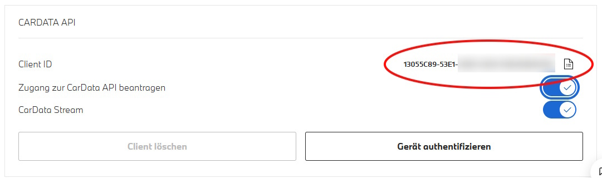

# BMW CarData Plugin für LoxBerry

[](https://github.com/Grestorn/loxberry-bmw-cardata)
[](https://www.loxwiki.eu/display/LOXBERRY/LoxBerry)

Integration von BMW CarData in Loxone über LoxBerry MQTT Gateway.

---

## 🇩🇪 Anwenderdokumentation (Deutsch)

### Einsatzzweck

Dieses Plugin ermöglicht die Übertragung von BMW Fahrzeugdaten vom **BMW CarData Portal** über den **LoxBerry MQTT Gateway** zum **Loxone Miniserver**.

**Verfügbare Statusdaten (Beispiele):**
- Türstatus (versperrt/offen)
- Kilometerstand
- Batterieladestand (bei Elektro-/Hybridfahrzeugen)
- Tankfüllung
- GPS-Position
- Reifendruck
- Fahrzeugstatus (geparkt, in Bewegung)
- Und viele weitere...

**Echtzeit-Übertragung:**
Die Daten werden von BMW in Echtzeit übertragen, sobald sich einer der Werte ändert. Dies ermöglicht aktuelle Informationen ohne Verzögerung.

**Anwendungsfälle in Loxone:**
- 🔋 **Intelligente Ladesteuerung:** Batterieladestand für automatische Ladesteuerung nutzen (z.B. Laden bei günstigen Stromtarifen)
- 📊 **Visualisierung:** Fahrzeugstatus in der Loxone UI anzeigen
- 🏠 **Automatisierungen:** Aktionen basierend auf Fahrzeugzustand auslösen (z.B. Garage öffnen, wenn Fahrzeug in der Nähe)

### Features

- ✅ OAuth 2.0 Authentifizierung mit BMW CarData API
- ✅ Automatische Token-Verwaltung (alle 10 Minuten, Anmeldung bleibt gültig)
- ✅ MQTT Bridge für Echtzeit-Datenübertragung
- ✅ Benutzerfreundliches Web-Interface für Konfiguration
- ✅ Unterstützung für mehrere Fahrzeuge
- ✅ Automatischer Start der Bridge nach erfolgreicher Anmeldung

### Voraussetzungen

- **LoxBerry** ab Version 3.0
- **BMW-Fahrzeug** mit BMW ConnectedDrive
- **BMW CarData Portal Zugang** (kostenlos für BMW-Kunden)
- Aktive Internetverbindung

### Installation

1. Öffne im LoxBerry die **"Plugin Verwaltung"**
2. Gehe zum Abschnitt **"Installiere neues Plugin"**
3. Trage die URL zum ZIP-File des neuesten Releases ein:
   - Alle Releases findest du unter: https://github.com/Grestorn/loxberry-bmw-cardata/releases
   - Aktuelles Release (0.4.3): `https://github.com/Grestorn/loxberry-bmw-cardata/archive/refs/tags/0.4.3.zip`
4. Gib deine **eigene SecurePIN** ein
5. Klicke auf **"Installation"**
6. Warte, bis die Installation abgeschlossen ist
7. Öffne das Plugin durch **Klick auf das Icon** oder den Text **"bmw-cardata"**
8. Es öffnet sich die Konfigurationsseite

Nach der Installation fährst du mit dem folgenden Konfigurationsprozess fort.

### Konfiguration

#### Schritt 1: BMW CarData Portal öffnen

1. Navigiere zur [MyBMW Fahrzeugübersicht](https://www.bmw.de/de-de/mybmw/vehicle-overview)
   - **Hinweis für internationale Nutzer:** Die URL kann je nach Land abweichen (z.B. `.com`, `.co.uk`, etc.)
2. Wähle ein Fahrzeug aus

> **⚠️ Wichtig:** Es genügt, die Schnittstelle für **EIN Fahrzeug** einzurichten. Der CarData Stream enthält automatisch die Daten **ALLER** dem Benutzer zugeordneten Fahrzeuge.


#### Schritt 2: CarData Client erstellen

1. Auf der BMW CarData Seite nach unten scrollen
2. Button **"CarData Client erstellen"** klicken
3. Im sich öffnenden Fenster wird die neu erzeugte **Client-ID** angezeigt
4. **Client-ID kopieren** und für Schritt 5 bereithalten
5. **Beide Optionen aktivieren:**
   - ✅ **"CarData Stream"**
   - ✅ **"Zugang zur CarData API beantragen"**
6. **⚠️ NICHT auf den Button "Gerät authentifizieren" drücken!** (Die Authentifizierung erfolgt später über das Plugin)

> **ℹ️ Hinweis:** Die BMW CarData Seite hat derzeit Performance-Probleme und reagiert sehr langsam. Es können auch 10-20 Sekunden nach einem Klick noch Fehlermeldungen erscheinen. Falls dies passiert, muss der Vorgang wiederholt werden.



#### Schritt 3: CarData Streaming konfigurieren

1. Weiter nach unten zum Abschnitt **"CarData Streaming"** scrollen
2. Button **"Datenstream konfigurieren"** klicken
3. Im sich öffnenden Dialog unten auf **"Verbindungsdetails anzeigen"** klicken, damit alle Daten sichtbar werden
4. **Benutzername kopieren** und für Schritt 5 bereithalten
5. **Host und Port überprüfen** und mit den Plugin-Defaults vergleichen:
   - Standard Host: `customer.streaming-cardata.bmwgroup.com`
   - Standard Port: `9000`
   - Bei Abweichungen die Werte notieren für Schritt 5


#### Schritt 4: Datenauswahl und Stream starten

1. Button **"Datenauswahl ändern"** klicken
2. **Nur die wirklich benötigten Werte auswählen** (z.B. Batterieladestand, Türstatus, Kilometerstand, GPS-Position)

> **⚠️ Wichtig:** Nicht alle verfügbaren Werte aktivieren! Wähle nur die Daten aus, die du tatsächlich in Loxone verwenden möchtest, um die Last auf Netzwerk und LoxBerry gering zu halten.

3. Nach Abschluss der Auswahl: Button **"Absenden und Stream starten"** klicken

#### Schritt 5: Plugin-Konfiguration vervollständigen

1. Öffne das Plugin im LoxBerry
2. Trage die kopierten Werte ein:
   - **BMW CarData Client-ID** (aus Schritt 2)
   - **MQTT Stream Host** (Standard: `customer.streaming-cardata.bmwgroup.com`)
   - **MQTT Stream Port** (Standard: `9000`)
   - **MQTT Stream Benutzername** (aus Schritt 3)
   - **MQTT Topic-Präfix für LoxBerry** (Standard: `bmw`)

> **ℹ️ Hinweis:** Das Feld **"Fahrzeug-Identifikationsnummern (VINs)"** kann leer bleiben - es wird automatisch bei der Anmeldung ausgefüllt.

3. Konfiguration mit **"Konfiguration speichern"** speichern


#### Schritt 6: Plugin-Anmeldung bei BMW durchführen

Nach dem Speichern der Konfiguration erscheint der Anmeldungsprozess:

##### 6.1 Registrierung starten (Schritt 3 im Plugin)

1. Button **"Registrierung starten"** klicken
2. Das Plugin generiert einen Geräte-Code bei BMW
3. Nach erfolgreicher Generierung wird Schritt 4 automatisch aktiviert

##### 6.2 BMW-Anmeldung durchführen (Schritt 4 im Plugin)

1. Button **"Zur BMW Anmeldung"** klicken (öffnet ein neues Browser-Fenster)
2. Mit **BMW-ID** (E-Mail und Passwort) anmelden
3. Die **Autorisierungsanfrage bestätigen**

> **⚠️ Wichtig:** Der Code ist 5 Minuten gültig. Die Restzeit wird im Plugin angezeigt.

##### 6.3 Tokens abrufen (Schritt 5 im Plugin)

1. Nach erfolgreicher BMW-Anmeldung: zurück zum Plugin
2. Button **"Tokens abrufen"** klicken
3. Das Plugin holt die Authentifizierungs-Tokens von BMW ab
4. Nach erfolgreicher Authentifizierung wird die **MQTT Bridge automatisch gestartet**
5. Du siehst die Meldung: **"Authentifizierung erfolgreich! Tokens wurden gespeichert."**

> **ℹ️ Hinweis:** Falls du die BMW-Anmeldung noch nicht abgeschlossen hast, erscheint die Meldung *"Die Anmeldung wurde nicht innerhalb der verfügbaren Zeit abgeschlossen."* - in diesem Fall einfach die BMW-Anmeldung (Schritt 6.2) abschließen und den Button "Tokens abrufen" erneut klicken.

### MQTT Bridge Status

Nach erfolgreicher Anmeldung wird die MQTT Bridge automatisch gestartet. Der Status wird im Plugin angezeigt:

- **Läuft** (grün): Die Bridge ist aktiv und leitet Daten weiter
- **Gestoppt** (rot): Die Bridge ist nicht aktiv

**Automatische Funktionen:**
- ✅ Token-Verwaltung: Tokens werden alle 10 Minuten automatisch erneuert
- ✅ Anmeldung automatisch verlängert: Solange das Plugin läuft, bleibt die Anmeldung gültig (bis zu 2 Wochen)
- ✅ Bridge-Start beim Systemstart: Die Bridge startet automatisch nach einem Neustart

### MQTT Topics in Loxone verwenden

Die Fahrzeugdaten werden über MQTT Topics im folgenden Format bereitgestellt:

**Topic-Format:**
```
<prefix>/<VIN>/<attribut>
```

**Beispiel-Topics:**
```
bmw/WBA12345678901234/data/vehicle.powertrain.electric.battery.charging.acousticLimit/timestamp
bmw/WBA12345678901234/data/vehicle.body.chargingPort.status/value
bmw/WBA12345678901234/data/vehicle.body.doors.frontLeft.lockState/value
bmw/WBA12345678901234/data/vehicle.location.coordinates.latitude/value
bmw/WBA12345678901234/data/vehicle.powertrain.electric.battery.chargeLevel.percent/value
```

> **⚠️ Wichtiger Hinweis:** BMW sendet **keine Daten**, solange das Fahrzeug steht und keine Veränderungen stattfinden. Um den Datenfluss zu testen, kannst du z.B. das Auto öffnen (sofern der Türschloss-Status bei den zu übertragenden Daten ausgewählt wurde).

#### Schritt 1: Datenempfang überprüfen

1. Öffne im Plugin die **"Logs"** Seite
2. Wähle das **"bmw-cardata-bridge"** Log
3. Nach ca. 1 Minute sollte ein Zähler erscheinen, der die Anzahl der weitergeleiteten Messages anzeigt
   - Beispiel: `Forwarded 5 messages in last minute (total: 15)`
4. Wenn hier Nachrichten gezählt werden, funktioniert die Bridge korrekt

#### Schritt 2: Topics im MQTT Finder finden

1. Öffne **LoxBerry MQTT Gateway** (anderes Plugin)
2. Wechsle zum Tab **"MQTT Finder"**
3. Suche nach dem Topic **`bmw/<VIN>`** (z.B. `bmw/WBA12345678901234`)
4. Hier sollten alle empfangenen Topics des Fahrzeugs aufgelistet sein

#### Schritt 3: Gateway Subscription einrichten

1. Im **LoxBerry MQTT Gateway** zum Tab **"MQTT Gateway"** wechseln
2. Abschnitt **"Gateway Subscription"** öffnen
3. Neue Subscription hinzufügen:
   - **Alle BMW-Daten übertragen:** `bmw/#`
   - **Nur ein bestimmtes Fahrzeug:** `bmw/WBA12345678901234/#`
   - **Nur bestimmte Attribute:** `bmw/WBA12345678901234/data/vehicle.powertrain.electric.battery/#`

4. **Optional:** Traffic reduzieren mit Filter-Expression
   - Im Feld **"Subscription Filter Expression (RegEx)"** eintragen: `^(?!.*_value$).+`
   - Dieser Filter lässt nur Messages durch, die auf `_value` enden
   - Dadurch werden Metadaten (Zeitstempel, Einheiten) herausgefiltert
   - Das reduziert den Traffic deutlich, da nur die tatsächlichen Werte übertragen werden

5. Subscription speichern

#### Schritt 4: In Loxone verwenden

Für die Einrichtung in Loxone Config (Virtual Inputs anlegen, Topics abonnieren, etc.) folge der Schritt-für-Schritt-Anleitung im LoxBerry Wiki:

👉 [MQTT Gateway - Schritt für Schritt MQTT Loxone](https://wiki.loxberry.de/konfiguration/widget_help/widget_mqtt/mqtt_gateway/mqtt_schritt_fur_schritt_mqtt_loxone)

### Troubleshooting

#### Problem: Anmeldung schlägt fehl
- **Lösung 1:** Prüfe, ob die Client-ID korrekt kopiert wurde
- **Lösung 2:** Prüfe, ob der Stream-Benutzername korrekt eingetragen wurde
- **Lösung 3:** Prüfe die Logs auf der "Logs" Tab-Seite des Plugins

#### Problem: Bridge startet nicht
- **Lösung 1:** Prüfe, ob die Anmeldung erfolgreich war (Status "Authentifiziert")
- **Lösung 2:** Prüfe die Logs auf der "Logs" Tab-Seite
- **Lösung 3:** Token manuell aktualisieren (Button "Token manuell aktualisieren")

#### Problem: Keine Daten in Loxone
- **Lösung 1:** Prüfe, ob die Bridge läuft (Status im Plugin)
- **Lösung 2:** Prüfe, ob im BMW Portal Daten ausgewählt wurden (Schritt 4)
- **Lösung 3:** Prüfe die MQTT-Verbindung zum LoxBerry MQTT Gateway
- **Lösung 4:** Prüfe die Bridge-Logs (Anzahl weitergeleiteter Nachrichten wird jede Minute protokolliert)

#### Problem: BMW CarData Portal reagiert nicht
- **Hinweis:** Die BMW Seite hat derzeit Performance-Probleme
- **Lösung:** Geduldig warten (10-20 Sekunden), bei Fehlermeldung Vorgang wiederholen

### FAQ

**F: Wie lange ist die Anmeldung gültig?**
A: Die Anmeldung wird automatisch alle 10 Minuten erneuert und bleibt gültig, solange das Plugin läuft. Die maximale Gültigkeit ohne Erneuerung beträgt 2 Wochen.

**F: Muss ich für jedes Fahrzeug eine eigene Konfiguration erstellen?**
A: Nein! Der CarData Stream enthält automatisch Daten von ALLEN Fahrzeugen, die deinem BMW-Account zugeordnet sind.

**F: Welche Daten sollte ich im BMW Portal auswählen?**
A: Wähle nur die Daten aus, die du wirklich benötigst. Weniger Daten = weniger Last auf Netzwerk und LoxBerry.

**F: Kostet die Nutzung von BMW CarData etwas?**
A: Nein, BMW CarData ist für BMW-Kunden kostenlos verfügbar.

**F: Was passiert bei einem LoxBerry-Neustart?**
A: Die Bridge startet automatisch beim Systemstart. Tokens werden vom Cron-Job alle 10 Minuten aktualisiert.

---

## 🇬🇧 User Documentation (English)

### Purpose

This plugin enables the transmission of BMW vehicle data from the **BMW CarData Portal** via the **LoxBerry MQTT Gateway** to the **Loxone Miniserver**.

**Available Status Data (Examples):**
- Door status (locked/unlocked)
- Mileage
- Battery charge level (for electric/hybrid vehicles)
- Fuel level
- GPS position
- Tire pressure
- Vehicle status (parked, in motion)
- And many more...

**Real-time Transmission:**
Data is transmitted by BMW in real-time as soon as any value changes. This ensures up-to-date information without delay.

**Use Cases in Loxone:**
- 🔋 **Smart Charging Control:** Use battery charge level for automatic charging control (e.g., charging during low electricity rates)
- 📊 **Visualization:** Display vehicle status in Loxone UI
- 🏠 **Automations:** Trigger actions based on vehicle status (e.g., open garage when vehicle is nearby)

### Features

- ✅ OAuth 2.0 authentication with BMW CarData API
- ✅ Automatic token management (every 10 minutes, authentication remains valid)
- ✅ MQTT bridge for real-time data transmission
- ✅ User-friendly web interface for configuration
- ✅ Support for multiple vehicles
- ✅ Automatic bridge start after successful authentication

### Requirements

- **LoxBerry** version 3.0 or higher
- **BMW vehicle** with BMW ConnectedDrive
- **BMW CarData Portal access** (free for BMW customers)
- Active internet connection

### Installation

1. Open **"Plugin Management"** in LoxBerry
2. Go to the section **"Install New Plugin"**
3. Enter the URL to the ZIP file of the latest release:
   - All releases can be found at: https://github.com/Grestorn/loxberry-bmw-cardata/releases
   - Current release (0.4.3): `https://github.com/Grestorn/loxberry-bmw-cardata/archive/refs/tags/0.4.3.zip`
4. Enter your **own SecurePIN**
5. Click **"Install"**
6. Wait for the installation to complete
7. Open the plugin by **clicking the icon** or the text **"bmw-cardata"**
8. The configuration page will open

After installation, proceed with the configuration process below.

### Configuration

#### Step 1: Open BMW CarData Portal

1. Navigate to [MyBMW Vehicle Overview](https://www.bmw.de/de-de/mybmw/vehicle-overview)
   - **Note for international users:** The URL may differ by country (e.g., `.com`, `.co.uk`, etc.)
2. Select a vehicle

> **⚠️ Important:** It is sufficient to set up the interface for **ONE vehicle**. The CarData Stream automatically includes data from **ALL** vehicles assigned to the user.


#### Step 2: Create CarData Client

1. Scroll down on the BMW CarData page
2. Click the **"Create CarData Client"** button
3. The newly generated **Client ID** will be displayed in the opening window
4. **Copy the Client ID** and keep it for step 5
5. **Activate both options:**
   - ✅ **"CarData Stream"**
   - ✅ **"Request access to CarData API"**
6. **⚠️ DO NOT click the "Authenticate Device" button!** (Authentication will be done later via the plugin)

> **ℹ️ Note:** The BMW CarData page currently has performance issues and responds very slowly. Error messages may appear even 10-20 seconds after a click. If this happens, the process must be repeated.


#### Step 3: Configure CarData Streaming

1. Scroll further down to the **"CarData Streaming"** section
2. Click the **"Configure Data Stream"** button
3. In the opening dialog, click **"Show Connection Details"** at the bottom to display all data
4. **Copy the username** and keep it for step 5
5. **Verify host and port** and compare with plugin defaults:
   - Default host: `customer.streaming-cardata.bmwgroup.com`
   - Default port: `9000`
   - Note any differences for step 5


#### Step 4: Data Selection and Start Stream

1. Click the **"Change Data Selection"** button
2. **Select only the values you actually need** (e.g., battery charge level, door status, mileage, GPS position)

> **⚠️ Important:** Do not activate all available values! Only select the data you will actually use in Loxone to keep the load on network and LoxBerry minimal.

3. After completing the selection: Click the **"Submit and Start Stream"** button

#### Step 5: Complete Plugin Configuration

1. Open the plugin in LoxBerry
2. Enter the copied values:
   - **BMW CarData Client ID** (from step 2)
   - **MQTT Stream Host** (default: `customer.streaming-cardata.bmwgroup.com`)
   - **MQTT Stream Port** (default: `9000`)
   - **MQTT Stream Username** (from step 3)
   - **MQTT Topic Prefix for LoxBerry** (default: `bmw`)

> **ℹ️ Note:** The **"Vehicle Identification Numbers (VINs)"** field can be left empty - it will be filled automatically during registration.

3. Save configuration with **"Save Configuration"**


#### Step 6: Perform Plugin Authentication with BMW

After saving the configuration, the authentication process appears:

##### 6.1 Start Registration (Step 3 in Plugin)

1. Click the **"Start Registration"** button
2. The plugin generates a device code with BMW
3. After successful generation, step 4 will be automatically activated

##### 6.2 Perform BMW Authentication (Step 4 in Plugin)

1. Click the **"Go to BMW Login"** button (opens a new browser window)
2. Log in with your **BMW ID** (email and password)
3. **Confirm the authorization request**

> **⚠️ Important:** The code is valid for 5 minutes. The remaining time is displayed in the plugin.

##### 6.3 Retrieve Tokens (Step 5 in Plugin)

1. After successful BMW authentication: return to the plugin
2. Click the **"Retrieve Tokens"** button
3. The plugin retrieves the authentication tokens from BMW
4. After successful authentication, the **MQTT bridge is automatically started**
5. You will see the message: **"Authentication successful! Tokens have been saved."**

> **ℹ️ Note:** If you have not yet completed the BMW authentication, the message *"Authentication was not completed within the available time."* will appear - in this case, simply complete the BMW authentication (step 6.2) and click the "Retrieve Tokens" button again.

### MQTT Bridge Status

After successful authentication, the MQTT bridge starts automatically. The status is displayed in the plugin:

- **Running** (green): Bridge is active and forwarding data
- **Stopped** (red): Bridge is not active

**Automatic Functions:**
- ✅ Token Management: Tokens are automatically renewed every 10 minutes
- ✅ Authentication Automatically Extended: As long as the plugin is running, authentication remains valid (up to 2 weeks)
- ✅ Bridge Auto-start: Bridge starts automatically after system reboot

### Using MQTT Topics in Loxone

Vehicle data is provided via MQTT topics in the following format:

**Topic Format:**
```
<prefix>/<VIN>/<attribute>
```

**Example Topics:**
```
bmw/WBA12345678901234/data/vehicle.powertrain.electric.battery.charging.acousticLimit/timestamp
bmw/WBA12345678901234/data/vehicle.body.chargingPort.status/value
bmw/WBA12345678901234/data/vehicle.body.doors.frontLeft.lockState/value
bmw/WBA12345678901234/data/vehicle.location.coordinates.latitude/value
bmw/WBA12345678901234/data/vehicle.powertrain.electric.battery.chargeLevel.percent/value
```

> **⚠️ Important Note:** BMW does **not send data** while the vehicle is stationary and no changes occur. To test the data flow, you can e.g. unlock the car (if door lock status was selected in the data to be transmitted).

#### Step 1: Verify Data Reception

1. Open the **"Logs"** page in the plugin
2. Select the **"bmw-cardata-bridge"** log
3. After approximately 1 minute, a counter should appear showing the number of forwarded messages
   - Example: `Forwarded 5 messages in last minute (total: 15)`
4. If messages are being counted here, the bridge is working correctly

#### Step 2: Find Topics in MQTT Finder

1. Open **LoxBerry MQTT Gateway** (separate plugin)
2. Switch to the **"MQTT Finder"** tab
3. Search for the topic **`bmw/<VIN>`** (e.g., `bmw/WBA12345678901234`)
4. All received topics for the vehicle should be listed here

#### Step 3: Set Up Gateway Subscription

1. In **LoxBerry MQTT Gateway**, switch to the **"MQTT Gateway"** tab
2. Open the **"Gateway Subscription"** section
3. Add new subscription:
   - **Transfer all BMW data:** `bmw/#`
   - **Only a specific vehicle:** `bmw/WBA12345678901234/#`
   - **Only specific attributes:** `bmw/WBA12345678901234/data/vehicle.powertrain.electric.battery/#`

4. **Optional:** Reduce traffic with filter expression
   - In the **"Subscription Filter Expression (RegEx)"** field, enter: `^(?!.*_value$).+`
   - This filter only allows messages that end with `_value`
   - This filters out metadata (timestamps, units)
   - This significantly reduces traffic as only actual values are transmitted

5. Save subscription

#### Step 4: Use in Loxone

For setting up in Loxone Config (creating Virtual Inputs, subscribing to topics, etc.), follow the step-by-step guide in the LoxBerry Wiki:

👉 [MQTT Gateway - Step by Step MQTT Loxone](https://wiki.loxberry.de/konfiguration/widget_help/widget_mqtt/mqtt_gateway/mqtt_schritt_fur_schritt_mqtt_loxone)

### Troubleshooting

#### Problem: Authentication fails
- **Solution 1:** Check if the Client ID was copied correctly
- **Solution 2:** Check if the Stream Username was entered correctly
- **Solution 3:** Check the logs on the "Logs" tab page of the plugin

#### Problem: Bridge doesn't start
- **Solution 1:** Check if authentication was successful (status "Authenticated")
- **Solution 2:** Check the logs on the "Logs" tab page
- **Solution 3:** Manually refresh token (button "Manually Refresh Token")

#### Problem: No data in Loxone
- **Solution 1:** Check if the bridge is running (status in plugin)
- **Solution 2:** Check if data was selected in BMW portal (step 4)
- **Solution 3:** Check MQTT connection to LoxBerry MQTT Gateway
- **Solution 4:** Check bridge logs (number of forwarded messages is logged every minute)

#### Problem: BMW CarData Portal not responding
- **Note:** The BMW page currently has performance issues
- **Solution:** Be patient (10-20 seconds), repeat process if error occurs

### FAQ

**Q: How long is the authentication valid?**
A: Authentication is automatically renewed every 10 minutes and remains valid as long as the plugin is running. Maximum validity without renewal is 2 weeks.

**Q: Do I need to create a separate configuration for each vehicle?**
A: No! The CarData Stream automatically includes data from ALL vehicles assigned to your BMW account.

**Q: Which data should I select in the BMW portal?**
A: Select only the data you actually need. Less data = less load on network and LoxBerry.

**Q: Does using BMW CarData cost anything?**
A: No, BMW CarData is available free of charge for BMW customers.

**Q: What happens after a LoxBerry reboot?**
A: The bridge starts automatically at system startup. Tokens are updated by the cron job every 10 minutes.

---

## Technical Implementation

This section provides a high-level overview of the plugin's technical architecture.

### Architecture Overview

The plugin consists of several components:

- **Web Interface** (`webfrontend/htmlauth/index.cgi`): Perl CGI script providing configuration UI and OAuth flow management
- **OAuth Scripts** (`bin/oauth-init.pl`, `bin/oauth-poll.pl`): Handle BMW OAuth 2.0 Device Code Flow (RFC 8628)
- **Token Manager** (`bin/token-manager.pl`): Manages automatic token refresh (runs via cron every 10 minutes)
- **MQTT Bridge** (`bin/bmw-cardata-bridge.pl`): Daemon process that connects to BMW CarData MQTT stream and forwards messages to LoxBerry MQTT Gateway
- **Bridge Control** (`bin/bridge-control.sh`): System script for starting/stopping/restarting the bridge daemon

### OAuth 2.0 Authentication Flow

The plugin uses **OAuth 2.0 Device Authorization Grant** (RFC 8628):

1. **Device Code Request**: Generate PKCE challenge and request device code from BMW API
2. **User Authorization**: User authenticates via BMW web portal using the device code
3. **Token Polling**: Plugin polls BMW API to retrieve access token, ID token, and refresh token
4. **Token Refresh**: Tokens are automatically refreshed every 10 minutes via cron job (valid for 1 hour, refresh token valid for 2 weeks)

**Key Tokens:**
- **Access Token**: Used for BMW CarData REST API calls (1 hour validity)
- **ID Token**: Used as MQTT password for streaming connection (1 hour validity)
- **Refresh Token**: Used to obtain new access/ID tokens (2 weeks validity)

### MQTT Bridge Implementation

The bridge uses two MQTT connections:

1. **BMW CarData Connection** (`AnyEvent::MQTT`):
   - Protocol: MQTTS (MQTT over TLS)
   - Authentication: GCID (username) + ID Token (password)
   - Subscribes to: `<GCID>/<VIN>` for all configured vehicles
   - Limitation: Only ONE connection per GCID allowed by BMW

2. **LoxBerry MQTT Gateway Connection** (`Net::MQTT::Simple`):
   - Publishes to local LoxBerry MQTT broker
   - Topic transformation: `<GCID>/<VIN>/...` → `<prefix>/<VIN>/...` (username removed)

**Auto-Reconnect**: The bridge monitors `tokens.json` every 5 minutes and automatically reconnects when new tokens are detected (after cron job refresh).

### Data Persistence

- **`data/config.json`**: Plugin configuration (Client ID, Stream Host, VINs, MQTT prefix)
- **`data/tokens.json`**: OAuth tokens and expiry timestamps
- **`data/device_code.json`**: Temporary file during OAuth flow (deleted after successful authentication)
- **`data/pkce.json`**: Temporary PKCE verifier during OAuth flow (deleted after successful authentication)
- **`data/bridge.pid`**: PID file for bridge daemon process

### Automatic Functions

- **Token Refresh**: Cron job (`cron/cron.10min`) runs token-manager every 10 minutes to refresh tokens 15 minutes before expiry
- **Bridge Auto-start**: Boot script (`cron/cron.reboot`) starts bridge daemon on system startup
- **Graceful Shutdown**: Bridge handles SIGTERM/SIGINT for clean shutdown during plugin updates

### Technology Stack

- **Perl**: Core language for LoxBerry plugin development
- **LoxBerry Modules**: `LoxBerry::System`, `LoxBerry::Web`, `LoxBerry::Log`, `LoxBerry::JSON`, `LoxBerry::IO`
- **MQTT Libraries**: `AnyEvent::MQTT` (async BMW connection), `Net::MQTT::Simple` (LoxBerry connection)
- **HTTP Client**: `LWP::UserAgent` for BMW API calls
- **Template Engine**: `HTML::Template` for web interface

### Security Considerations

- OAuth tokens stored in `data/` directory (protected by LoxBerry file permissions)
- PKCE (Proof Key for Code Exchange) used for OAuth flow to prevent authorization code interception
- MQTT connection to BMW uses TLS encryption
- No credentials stored in plugin code or configuration

---

## License

Copyright © 2025 Martin Korndörfer

This project is licensed under the terms specified by the author.
